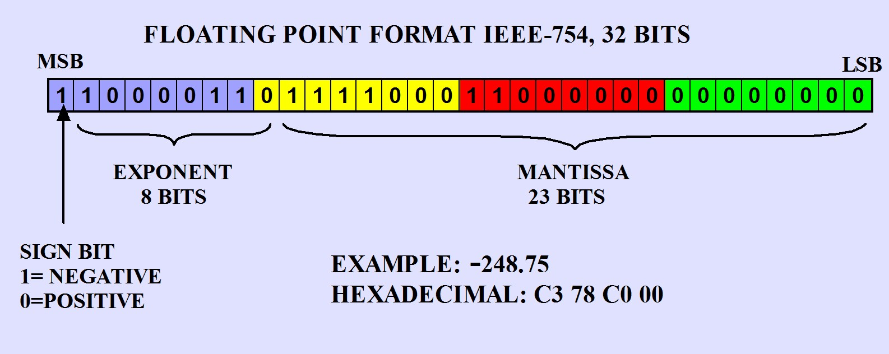

# IDATT2104-HDL

## ⚙ Setup
Minstekravet for å få kjørt koden er: 
- iverilog
- yosys

## 🚀 Kjøring av programmet
For å kjøre alle simulasjonene, kjør: 
```
make sim
```
Man kan også kjøre simulasjonene individuelt. Disse kan sjekkes ut i [Makefilen](https://github.com/Katanta/IDATT2104-HDL/blob/main/Makefile).

### Elementvis multiplikasjon
Simulasjonen for elementvis multiplikasjon kan du kjøre med:
```
make sim_elementwise_multiplication
```
Denne kjøres sekvensielt. For parallell kjøring, bruk: 
```
make sim_parallel_elementwise_multiplication_dynamic
```
Den sekvensielle algoritmen/modulen ganger sammen to vektorer med samme dimensjon. I simulasjonen er dette 2 vektorer med 8 elementer hver:

Den parallelle algoritmen/modulen kan gange ```N```-dimensjonelle matriser sammen, hvor ```N``` er et naturlig tall. I eksempelet vårt er begge 2D-matriser. 
Ettersom en matrise bare er en samling av vektorer, er matrisemultiplisering det samme som å parvis gange vektorer i matrisene sammen. 
Dermed kan vi instansiere ```N``` kopier av den sekvensielle modulen som kjører i parallell. Hver av dem sørger for å multiplisere et par med vektorer. 
Den parallelle kjøringen sørger for at kjøretiden er uavhengig av ```N```.

### Dot produkt
Simulasjonen for prikkprodukt kan du kjøre med: 
```
make sim_dot_product
```
Denne modulen gjør det samme som elementvis multiplikasjon, bortsett fra at den også summerer elementene i produktetmatrisen. Resultatet er en sum og ikke en matrise.
Summeringen skjer sekvensielt.

### Flyttallsaritmetikk
Simulasjonen for flyttallsmultiplikasjon kan du kjøre med:
```
make sim_float
```
Denne kjører alle regnestykkene for flere typer flyttall (8, 16 og 32 bit) og brukes i de to modulene.
Poenget med denne simulasjone er å demonstrere at vi har fått til å gange med flyttall, noe som kan 
implementeres i modulene over.

Flyttall representeres i bits ved hjelp av IEEE 754-standarden. Denne standarden definerer hvordan vi representerer flyttall både i enkel- og dobbeltpresisjon.
Flyttall er delt opp i tre hovedkomponenter: tegnbit, eksponent og mantisse. Strukturen til en float32 består av totalt 32 bits, hvor:
1 bit er reservert til tegnbiten. Denne bestemmer om tallet er positivt eller negativt; 0 for positivt og 1 for negativt.

8 bits brukes til eksponenten, som representerer størrelsesorden til tallet. Eksponenten er lagret med en bias på 127, som vi må trekke fra for å få den reelle eksponenten.

De siste 23 bitsa er for mantissen. Dette representerer den signifikante delen av tallet, og vi antar at det er en implisitt ledende 1 foran disse 23 bitsa for normaliserte tall.
